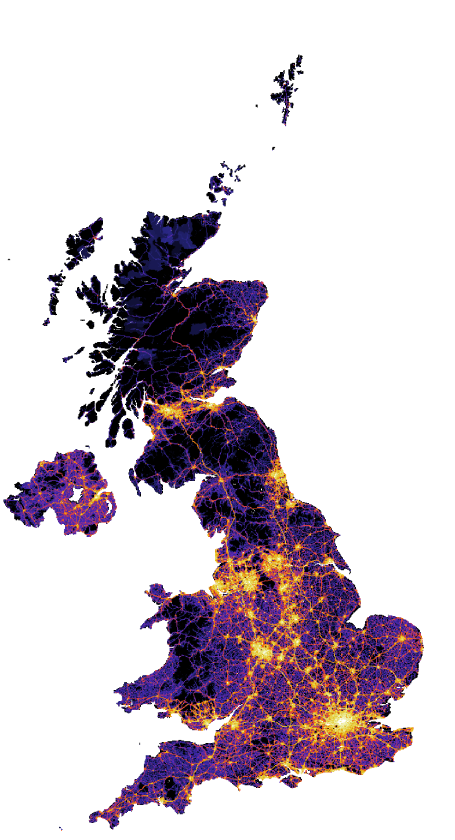

```{=html}
<div class="hero-banner">

  <!-- GEMMA logo ────────────────────────────────────────────────────────────
       Once you have the logo file, replace the placeholder <div> below with:
         
       Use a white or light-coloured version of the logo (background is dark blue).
       Recommended: SVG or PNG, roughly 200–300 px wide, transparent background.
       Also uncomment the three logo-* lines in _quarto.yml for the navbar.  ── -->
  
  <p class="lead">
    Advancing greenhouse gas measurement and modelling to support
    UK climate policy and global emissions accountability.
  </p>
  <div class="hero-buttons">
    <a href="about.qmd" class="btn btn-light btn-lg">About the project</a>
    <a href="research-highlights/index.qmd" class="btn btn-outline-light btn-lg">Research highlights</a>
  </div>
</div>
```

```{=html}
<!-- Feature split ─────────────────────────────────────────────────────────────
     Replace assets/uk-emissions-map.png with your image file.
     The image is displayed at up to 280 px wide at its natural proportions,
     so portrait-format maps work well here.
     Update the alt text and the figcaption to describe the specific figure.  -->
<div class="feature-split">
  <div class="feature-split-text">
    <h2>Independent, atmosphere-based estimates of UK greenhouse gas emissions</h2>
    <p>GEMMA combines measurements from atmospheric monitoring stations across the
    UK and Ireland with inverse modelling to produce independent estimates of
    greenhouse gas emissions from each part of the country — providing an evidence
    base that is separate from the statistical methods used in official greenhouse
    gas inventories.</p>
  </div>
  <div class="feature-split-image">
    
    <!-- <figcaption>Optional short caption describing the figure.</figcaption> -->
  </div>
</div>
```

```{=html}
<div class="stats-bar">
  <div class="stats-inner">
    <div class="stat-item">
      <span class="stat-number">7</span>
      <span class="stat-label">Partner organisations</span>
    </div>
    <div class="stat-item">
      <span class="stat-number">10+</span>
      <span class="stat-label">Scientists</span>
    </div>
    <div class="stat-item">
      <span class="stat-number">2</span>
      <span class="stat-label">Years of research</span>
    </div>
  </div>
</div>
```

## About the project {.section-header}

::: {.section-block}
::: {.columns}
::: {.column width="60%"}
The GEMMA project (Greenhouse gas Measurement and Modelling Advancement) is a
UK research collaboration bringing together expertise in atmospheric measurement,
inverse modelling, and climate science. Our goal is to improve the accuracy and
credibility of national greenhouse gas inventories and support evidence-based
climate policy.

We develop novel measurement techniques, deploy cutting-edge observation networks,
and combine these with state-of-the-art atmospheric models to independently verify
reported emissions across the UK and beyond.

[Read more about GEMMA](about.qmd){.btn .btn-primary .mt-2}
:::
::: {.column width="40%"}
::: {.callout-note appearance="minimal"}
**Key objectives**

- Develop and validate new greenhouse gas measurement methods
- Improve atmospheric inversion techniques for emissions estimation
- Provide independent verification of national greenhouse gas inventories
- Produce actionable evidence for policy-makers
:::
:::
:::
:::

## Recent research highlights {.section-header}

::: {.section-block .section-tinted}
::: {#recent-highlights}
:::

::: {style="text-align: center; margin-top: 1.5rem;"}
[View all research highlights](research-highlights/index.qmd){.btn .btn-primary}
:::
:::

## Our partners {.section-header}

::: {.section-block}
::: {.partner-logos}
<!-- Replace these spans with  tags once logo files are available -->
<!-- Example:  -->
<span class="partner-name">National Physical Laboratory</span>
<span class="partner-name">University of Bristol</span>
<span class="partner-name">Met Office</span>
<span class="partner-name">University of East Anglia</span>
<span class="partner-name">University of Manchester</span>
<span class="partner-name">NCAS</span>
<span class="partner-name">NCEO</span>
:::
:::
