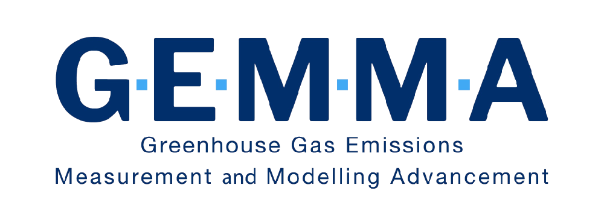
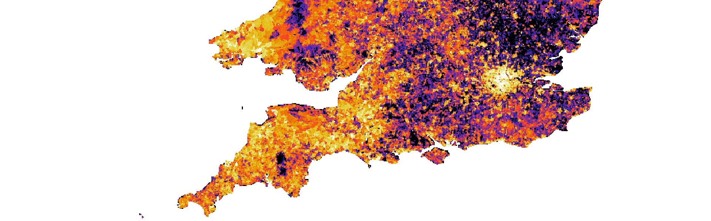

```{=html}
<div class="hero-banner">

  <!-- GEMMA logo ────────────────────────────────────────────────────────────
       Once you have the logo file, replace the placeholder <div> below with:
         
       Use a white or light-coloured version of the logo (background is dark blue).
       Recommended: SVG or PNG, roughly 200–300 px wide, transparent background.
       Also uncomment the three logo-* lines in _quarto.yml for the navbar.  ── -->
  
  <p class="lead">
    Advancing greenhouse gas measurement and modelling to support
    UK climate policy and global emissions accountability.
  </p>
  <div class="hero-buttons">
    <a href="about.qmd" class="btn btn-light btn-lg">About the project</a>
    <a href="research-highlights/index.qmd" class="btn btn-outline-light btn-lg">Research highlights</a>
  </div>
</div>
```

```{=html}
<!-- Feature image ─────────────────────────────────────────────────────────────
     To replace the placeholder with a real image:
       1. Copy your image to assets/feature-image.jpg (or .png / .webp)
       2. Delete the <div class="feature-image-placeholder">…</div> block below
       3. Uncomment the  tag
       4. Update the alt text to describe what the image shows
       5. Optionally add a caption by uncommenting the <figcaption> tag
     Recommended dimensions: 1920 × 600 px, landscape orientation.  ─────────── -->
<figure class="feature-image-wrap">
   -->
  <!-- <figcaption>Optional caption, e.g. "Atmospheric monitoring station at Tacolneston, Norfolk."</figcaption> -->
</figure>
```

```{=html}
<div class="stats-bar">
  <div class="stats-inner">
    <div class="stat-item">
      <span class="stat-number">4</span>
      <span class="stat-label">Partner organisations</span>
    </div>
    <div class="stat-item">
      <span class="stat-number">30+</span>
      <span class="stat-label">Scientists</span>
    </div>
    <div class="stat-item">
      <span class="stat-number">5</span>
      <span class="stat-label">Years of research</span>
    </div>
    <div class="stat-item">
      <span class="stat-number">12+</span>
      <span class="stat-label">Peer-reviewed publications</span>
    </div>
  </div>
</div>
```

## About the project {.section-header}

::: {.section-block}
::: {.columns}
::: {.column width="60%"}
The GEMMA project (Greenhouse gas Measurement and Modelling Advancement) is a
UK research collaboration bringing together expertise in atmospheric measurement,
inverse modelling, and climate science. Our goal is to improve the accuracy and
credibility of national greenhouse gas inventories and support evidence-based
climate policy.

We develop novel measurement techniques, deploy cutting-edge observation networks,
and combine these with state-of-the-art atmospheric models to independently verify
reported emissions across the UK and beyond.

[Read more about GEMMA](about.qmd){.btn .btn-primary .mt-2}
:::
::: {.column width="40%"}
::: {.callout-note appearance="minimal"}
**Key objectives**

- Develop and validate new greenhouse gas measurement methods
- Improve atmospheric inversion techniques for emissions estimation
- Provide independent verification of national greenhouse gas inventories
- Produce actionable evidence for policy-makers
:::
:::
:::
:::

## Recent research highlights {.section-header}

::: {.section-block .section-tinted}
::: {#recent-highlights}
:::

::: {style="text-align: center; margin-top: 1.5rem;"}
[View all research highlights](research-highlights/index.qmd){.btn .btn-primary}
:::
:::

## Our partners {.section-header}

::: {.section-block}
::: {.partner-logos}
<!-- Replace these with actual logo images once available -->
<!-- Example:  -->
<span class="partner-name">National Physical Laboratory</span>
<span class="partner-name">University of Bristol</span>
<span class="partner-name">Met Office</span>
<span class="partner-name">UKRI</span>
:::
:::
