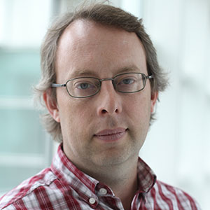
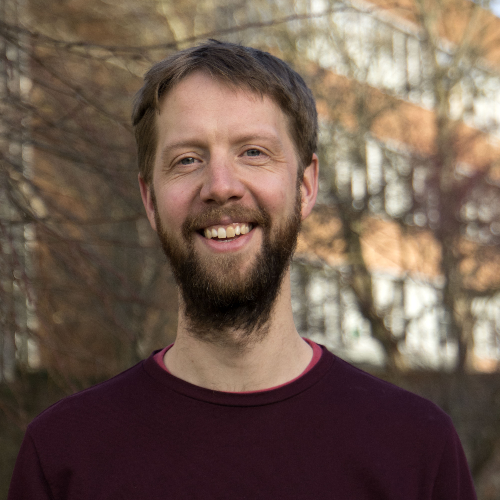

## Principal investigators

::: {.team-entry}
::: {.team-photo}
{fig-alt="Dr Tom Gardiner"}
:::
::: {.team-bio}
**Dr Tom Gardiner** · National Physical Laboratory

Lead on measurement traceability.
Research interests: atmospheric measurement, metrology, climate science.

[tg@npl.co.uk](mailto:tg@npl.co.uk) | [ORCID](https://orcid.org/0000-0000-0000-0000)
:::
:::

::: {.team-entry}
::: {.team-photo}
{fig-alt="Prof Matt Rigby"}
:::
::: {.team-bio}
**Prof Matt Rigby** · University of Bristol

Co-lead on inverse modelling.
Research interests: atmospheric measurement, metrology, climate science.

[matt.rigby@bristol.ac.uk](mailto:matt.rigby@bristol.ac.uk) | [ORCID](https://orcid.org/0000-0000-0000-0000)
:::
:::

---

## Researchers and postdoctoral fellows

*To be completed.*

## Advisory board

*To be completed.*

